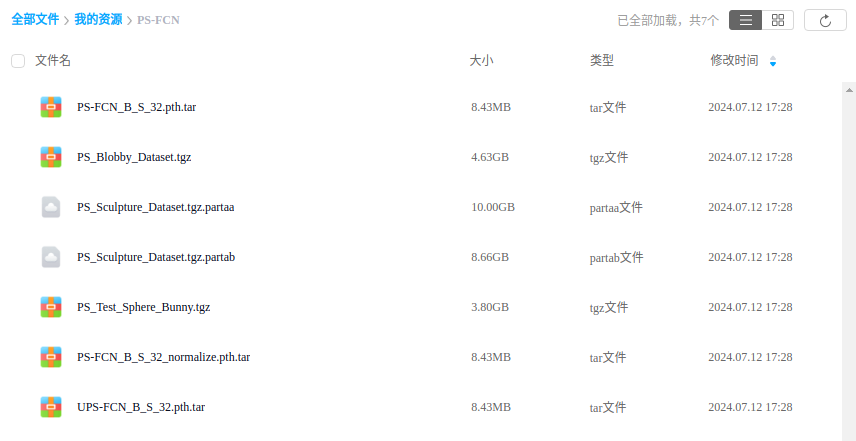
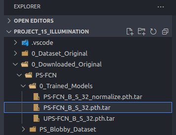
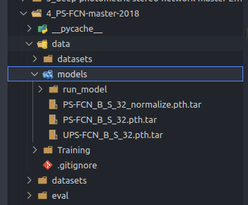
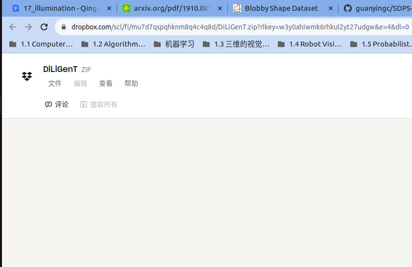
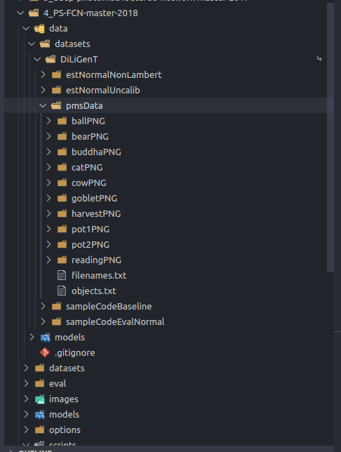
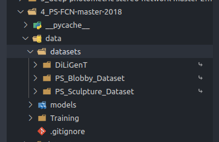
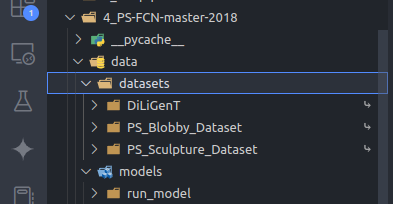
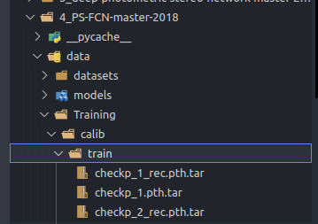
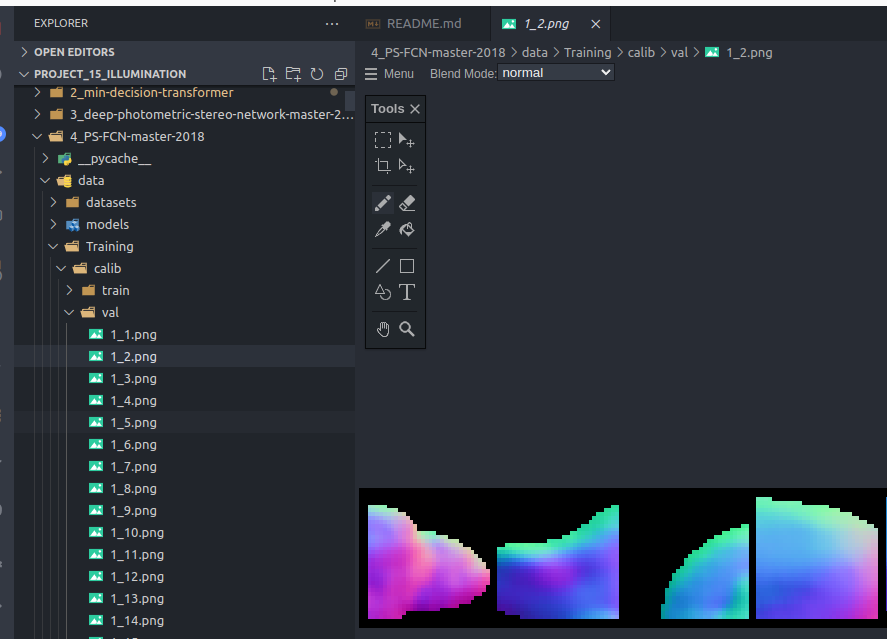
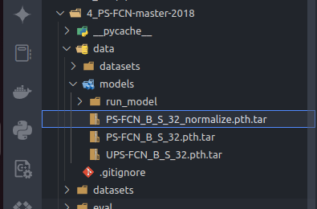

# PS-FCN
**[PS-FCN: A Flexible Learning Framework for Photometric Stereo, ECCV 2018](https://guanyingc.github.io/PS-FCN/)**,
<br>
[Guanying Chen](https://guanyingc.github.io/), [Kai Han](http://www.hankai.org/), [Kwan-Yee K. Wong](http://i.cs.hku.hk/~kykwong/)
<br>

This paper addresses the problem of learning based photometric stereo for non-Lambertian surface.
<br>
<p align="center">
    
</p>

### _Changelog_
- June 25, 2020: We have updated the code to support applying data normalization for handling surface with SVBRDFs, as introduced in the journal version of this work.
- July 27, 2019: We have already updated the code to support Python 3.7 + PyTorch 1.10. To run the previous version (Python 2.7 + PyTorch 0.40), please checkout to `python2.7` branch first (e.g., `git checkout python2.7`).


## Dependencies
PS-FCN is implemented in [PyTorch](https://pytorch.org/) and tested with Ubuntu 14.04, please install PyTorch first following the official instruction. 
- Python 3.7 
- PyTorch (version = 1.10)
- numpy
- scipy
- CUDA-9.0  

## Overview
We provide:
- Datasets: Blobby dataset (4.7 GB), Sculpture dataset (19 GB)
- Trained models (on both the Blobby dataset and the Sculpture dataset with a per-sample input number of 32):
    - PS-FCN for calibrated photometric stereo
    - UPS-FCN for uncalibrated photometric stereo
- Code to test on DiLiGenT main dataset
- Code to train a new model

# 没有使用 Data Normalization for Handling SVBRDFs (TPAMI)

## 使用 trained models 来做 Test
### 1. Download the trained models => 已经完成

通过访问 百度网盘地址：([PS-FCN and UPS-FCN](https://pan.baidu.com/s/1WUVu9ibIBh4wM1shTXBuNw?pwd=snyc)) 来下载 3个 trained models 然后 put `PS-FCN_B_S_32_normalize.pth.tar` & `PS-FCN_B_S_32.pth.tar` & `UPS-FCN_B_S_32.pth.tar` in `./data/models/`. 



#### (1) 下载3个 trained models(`PS-FCN_B_S_32_normalize.pth.tar` & `PS-FCN_B_S_32.pth.tar` & `UPS-FCN_B_S_32.pth.tar` )

 下载好的3个 原始 trained models:

  

然后移动到 ./data/models 目录下:

  
* Please note that the checkpoint names end with '.tar', and there is no need to untar them.

### 2. 下载 diligent 数据集


#### (1) 下载 diligent 数据集

在 https://www.dropbox.com/scl/fi/mu7d7qspqhknm8q4c4q8d/DiLiGenT.zip?e=3&rlkey=w3y0ahiwmk6rhkul2yt27udgw&dl=0 下载 DiLiGenT 数据集

  

解压并且放到 /home/qingpowuwu/Project_15_illumination/0_Dataset_Original/DiLiGenT 目录下




#### (2) 把 `/home/qingpowuwu/Project_15_illumination/0_Dataset_Original/DiLiGenT` 目录下 的 DiLiGenT 数据集 链接到 `4_PS-FCN-master-2018/data/datasets/DiLiGenT` 下面

通过运行下面的脚本来做链接:

```shell
# Download DiLiGenT main dataset
sh scripts/1_prepare_diligent_dataset.sh
```
下面就是下载好的数据集：




### 3. 使用 pretrained model & diligent 数据集来做 evaluation 

#### (1) 使用 image-light pairs 当作 input 来做 Testing

```shell
# Test PS-FCN on DiLiGenT main dataset using all of the 96 image-light pairs
CUDA_VISIBLE_DEVICES=0 python eval/run_model.py --retrain data/models/PS-FCN_B_S_32.pth.tar --in_img_num 96
```


训练的结果可以在 data/Training/run_model/ 中看到:

#### (2) 只使用 images 当作 input 来做 Testing

```shell

# Test UPS-FCN on DiLiGenT main dataset only using images as input 
CUDA_VISIBLE_DEVICES=0 python eval/run_model.py --retrain data/models/UPS-FCN_B_S_32.pth.tar --in_img_num 96 --in_light
```

训练的结果可以在 data/Training/run_model/ 中看到:


## Training
### 1. Train from Scratch

To train a new PS-FCN model, please follow the following steps:

#### (1) 下载 synthetic Blobby & Sculpture training 数据集 (4.7+19=23.7 GB) => 已经完成

通过访问 百度网盘地址：([PS-FCN and UPS-FCN](https://pan.baidu.com/s/1WUVu9ibIBh4wM1shTXBuNw?pwd=snyc)) 来下载 synthetic Blobby & Sculpture 数据集


#### (2) 把 `/home/qingpowuwu/Project_15_illumination/0_Dataset_Original/DiLiGenT` 目录下 的 synthetic Blobby & Sculpture training 数据集 连接到 `4_PS-FCN-master-2018/data/datasets/PS_Blobby_Dataset` & `4_PS-FCN-master-2018/data/datasets/PS_Sculpture_Dataset` 下面

通过运行下面的脚本来做链接:

```shell
sh scripts/2_download_synthetic_blobby_sculpture_datasets.sh
```
下面就是下载好的数据集：



#### (3) Train PS-FCN and UPS-FCN 模型

##### 开始训练

```shell
# Train PS-FCN on both synthetic datasets using 32 images-light pairs
CUDA_VISIBLE_DEVICES=0 python main.py --concat_data --in_img_num 32

# Train UPS-FCN on both synthetic datasets using 32 images
CUDA_VISIBLE_DEVICES=0 python main.py --concat_data --in_img_num 32 --in_light --item uncalib

# Please refer to options/base_opt.py and options/train_opt.py for more options

# You can find checkpoints and results in data/Training/
```

##### 查看结果

训练的结果 (train/checkpoints & val/images)可以在 `./data/Training/` 里面看到 

* ./data/Training/train/ 里面的 chekpoints

  

* ./data/Training/val/ 里面的图片

  

#### (4) 用 训练好的 PS-FCN and UPS-FCN 模型 做 Testing

我自己的

```shell
CUDA_VISIBLE_DEVICES=0 python eval/run_model.py --retrain data/Training/calib-2024-07-04/train/checkp_30.pth.tar --in_img_num 96
# You can find the results in data/Training/run_model
```


# Data Normalization for Handling SVBRDFs (TPAMI)

## 使用 trained models 来做 Test

### 1. 下载 trained models

 trained model `PS-FCN_B_S_32_normalize.pth.tar` 在之前已经下载好了，并且放到了  `./data/models/` 下面



#### 2. Test on the DiLiGenT main dataset

```shell
CUDA_VISIBLE_DEVICES=0 python eval/run_model.py --retrain data/models/PS-FCN_B_S_32_normalize.pth.tar --in_img_num 96 --normalize --train_img_num 32
# You can find the results in data/Training/run_model
```


## Train from Scratch

### 1. Training from Scratch

```shell
CUDA_VISIBLE_DEVICES=0 python main.py --concat_data --in_img_num 32 --normalize --item normalize
# You can find checkpoints and results in data/Training/normalize
```

<br>
<p align="center">
    
</p>

## FAQ

#### Q1: How to test PS-FCN on other dataset?
- You have to implement a customized Dataset class to load your data. Please refer to `datasets/DiLiGenT_data.py` for an example that loads the DiLiGenT main dataset.  - Precomputed results on DiLiGenT main/test dataset, Gourd\&Apple dataset, Light Stage Dataset and Synthetic Te-st dataset are available upon request.

#### Q2: Which eight sculpture shapes were used in rendering the training datasets? Why?
- Normal maps of the eight selected sculpture shapes are shown in the below figure (filenames can be found in this [link](images/sculpture_list.txt)). We chose these 8 shapes for their high quality meshes and complex geometry. Other complex 3D objects can also be used.
<p align="center">
    
</p>

#### Q3: What should I do if I have problem in running your code?
- Please create an issue if you encounter errors when trying to run the code. Please also feel free to submit a bug report.

#### Q4: Where can I download the Gourd&Apple dataset and Light Stage Data Gallery used in the paper?
- Gourd&Apple dataset is introduced in the paper [Photometric stereo with non-parametric and spatially-varying reflectance, Alldrin et al., CVPR 2008]. You may try to download this dataset from [Alldrin's homepage](http://vision.ucsd.edu/~nalldrin/research/). However, it seems that this link is not working now. You may send an email to the authors for this dataset. You can download the Light Stage Data Gallery from http://vgl.ict.usc.edu/Data/LightStage/. To test PS-FCN on these two datasets, please first preprocess and reorganize the images in a way similar to DiLiGent benchmark. 

## Citation
If you find this code or the provided data useful in your research, please consider cite: 
```
@inproceedings{chen2018ps,
  title={{PS-FCN}: A Flexible Learning Framework for Photometric Stereo},
  author={Chen, Guanying and Han, Kai and Wong, Kwan-Yee K.},
  booktitle={ECCV},
  year={2018}
  }
@article{chen2020deepps,
  title={Deep Photometric Stereo for Non-{Lambertian} Surfaces},
  author={Chen, Guanying and Han, Kai and Shi, Boxin and Matsushita, Yasuyuki and Wong, Kwan-Yee~K.},
  journal={TPAMI},
  year={2020},
}
```
